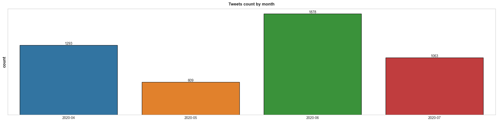
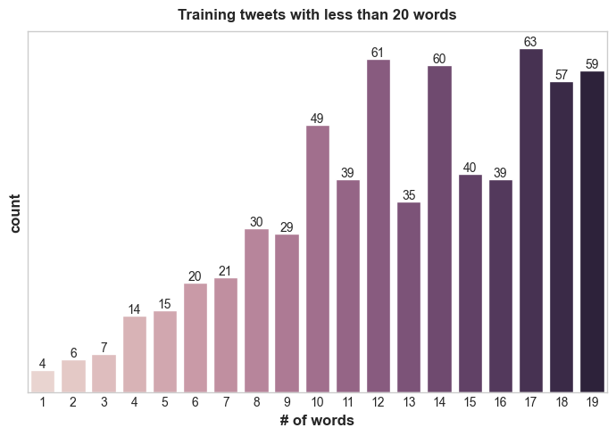

# Stock Tweets Sentiment Analysis
## About

We are going to perform a simple sentiment analysis on tweets related to the stock market using first the following <a href=https://www.kaggle.com/datasets/utkarshxy/stock-markettweets-lexicon-data>dataset from Kaggle</a> which consists of 9917 tweets collected between April 9 and July 16 of 2020,  using not only the SPX500 tag but also the top 25 companies in the index and "#stocks". 1300 tweets were manually classified and reviewed, being labeled as either positive, negative or neutral. The dataset has the following three variables: 

<ul>
<li><b>ID:</b> contains the tweet id
<li><b>Date and time:</b> date and time of the tweet's creation
<li><b>Tweet:</b> content of the tweet
<li><b>Sentiment:</b> whether the tweet was positive, negative or neutral
</ul>

After the first analysis, we will enrich the dataset with an extra dataset to reduce overfitting nd improve performance.

## Procedure

The objective will be to develop an effective model to predict the sentiment of stock market tweets. The main metric for success we are going to use is accuracy for simplicity.
The steps will be:
<ol>
<li>EDA (Explore dataset)
<li>Data Preprocessing (Clean tweets)
<li>Feature Engineering and Selection (Remove length of tweets and leave text_clean and sentiment columns)
<li>Model development (Naive-Bayes, BERT nad Roberta)
<li>Model evaluation
</ol>
We performed these steps once with the initial dataset and a second time with an enriched one.

## Exploring the data

For starters, we confirm there are only 1300 tweets labeled out of the 5000, we will try to compensate part of this lack of data oversampling however, we also search for an extra dataset since training a complex model such as BERT with scarce data might be a cause for concern and lead to overfitting. We also discovered there were 157 duplicates, after dropping them we end up with 1284 labeled data points.

We confirm there are no null values remaining in our dataset and convert created_at column to the proper date format (in this case we will use year and month only). The tweet distribution by month is as follows:
 

  

 

Taking a quick glance at a few of the data points we can see some tweets contain special characters and emojis, such as the one below, which we will have to take care of later when preprocessing the data.
 

  'RT @RobertBeadles: Yo💥\nEnter to WIN 1,000 Monarch Tokens✅\n\nUS Stock Market Crashes &amp; what we can LEARN from them PT3!\n\nRETWEET, WATCH video…'

## Data Preprocessing

First of all, we are going to define, using libraries like emoji and re, a few functions to clean our dataset such as:
<ul>
<li>strip_all_entities: remove punctuations, links, mentions and \r\n new line characters
<li>clean_hastags: clean hashtags at the end of the sentence, and keep those in the middle of the sentence by removing just the # symbol
<li>filter_char: filter special characters such as & and $ present in some words
<li>remove_mult_spaces: remove multiple spaces
</ul>

## Feature Engineering and Selection

After cleaning the tweets we proceed to analyze their length in order to filter excessively long or short tweets since we assume these will not be concise and therefore will not add relevant information to our model ultimately. The length distribution for short tweets is as follows: 
 

  

 

We decide to remove tweets which length is shorter than 5 words for the reasons stated before, they should not include much relevant information for our model. We then tokenize the tweets with BERT and after examining them remove those with more than 80 tokens.

We will use only text_clean and the target column sentiment, which we map to numerical values being positive:1, negative:-1 and neutral:0. As for class imbalances, there is some, so we decide to use RandomOverSampler to not only fix it but also increase our data points. Finally, we split the data into train, test and validation and one hot encode the target variable.

## Model Development and Evaluation

Our baseline model Naive-Bayes obtained an improvable accuracy of <b>0.63</b> and some similar results in recall and f1-score which can be observed below. We will try to improve this first by using a more complex model and then by adding additional data points.
 

|  | Precision | Recall | F1 Score |
|----------|----------|----------|----------|
| Negative    | 0.60  | 0.74  | 0.67  |
| Neutral    | 0.64  | 0.62  | 0.63  |
| Positive    | 0.66  | 0.54  | 0.59  |

After training BERT for 4 epochs (batch size of 32), we reach our accuracy of <b>0.73</b> which is not a great improvement. Analyzing the training of the BERT we can see the model might be overfitting so we will proceed to add additional data. The remaining results of BERT are as follows:
 

|  | Precision | Recall | F1 Score |
|----------|----------|----------|----------|
| Negative    | 0.72  | 0.82  | 0.77  |
| Neutral    | 0.78  | 0.62  | 0.89  |
| Positive    | 0.70  | 0.74  | 0.72  |

We proceed to merge both datasets into one and repeat the same steps as earlier: preprocessing, feature selection, oversampling, etc... We end up with a considerably greater amount of data (~11,6k) and it shows in the results.
 

Naive-Bayes performs reasonably better obtaining an <b>83%</b> accuracy and other improvements in the remaining metrics:
 

|  | Precision | Recall | F1 Score |
|----------|----------|----------|----------|
| Negative    | 0.76  | 0.82  | 0.79  |
| Neutral    | 0.91  | 1.00  | 0.90  |
| Positive    | 0.85  | 0.70  | 0.77  |

BERT also obtains greater metrics achieving satisfactory results with an accuracy of <b>89%</b>.
 

|  | Precision | Recall | F1 Score |
|----------|----------|----------|----------|
| Negative    | 0.81  | 0.93  | 0.87  |
| Neutral    | 0.97  | 1.00  | 0.98  |
| Positive    | 0.92  | 0.76  | 0.83  |

We could further aim to improve results by training other models such as ROBERTA (which when trained the first time this project was presented reached 91% accuracy), however given the improvement is not significant, results are not shown here.
 
